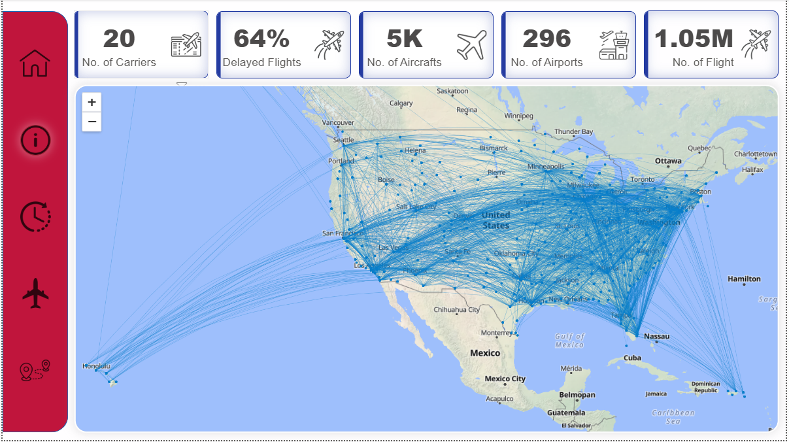

# ✈️ Airline Delay Analysis

> An end-to-end data analytics project that transforms raw US flight records into a clean star-schema data model and an interactive Power BI dashboard — uncovering the true causes and patterns behind airline delays.

---

## 📊 Dashboard Preview

### Cover

### Overview Page

### Delay Causes Breakdown

### Airline Performance

### Route & Airport Analysis

### Star schema

---

## 📌 Overview

This project analyzes the [Airline Delay Causes dataset](https://www.kaggle.com/datasets/giovamata/airlinedelaycauses/data) published by the **U.S. Bureau of Transportation Statistics (BTS)**. Starting from raw flight records, the project walks through a full analytics pipeline: data cleaning, dimensional modeling, and visual reporting.

## 🔄 Pipeline

### 1. 🧹 Data Cleaning (`Data_Cleaning_Airline.ipynb`)

Prepares the raw dataset for analysis through a structured 12-step pipeline:

| Step | Description |
|------|-------------|
| 1 | Import libraries |
| 2 | Load & initial exploration |
| 3 | Segment flights — Cancelled / Diverted / Delayed |
| 4 | Drop unnecessary columns |
| 5 | Rename columns for clarity |
| 6 | Fix data types — dates & time fields |
| 7 | Handle missing values |
| 8 | Remove duplicates |
| 9 | Outlier detection & capping |
| 10 | Memory optimization (category types) |
| 11 | Feature engineering & validation |
| 12 | Reorder columns & export |

**Output:** `Cleaned_delayed_flights.csv`

---

### 2. 🗃️ Data Modeling (`Data_Modeling.ipynb`)

Builds a **star schema** from the cleaned data, creating dimension and fact tables ready for Power BI:

| Table | Description |
|-------|-------------|
| `Fact_table` | Core flight delay metrics |
| `Dim_Date` | Full date dimension (2008) |
| `Dim_Airport` | Origin & destination airports |
| `Dim_Aircraft` | Aircraft info with surrogate keys |
| `Dim_Route` | Origin–destination route pairs |
| `Dim_Carrier` | Airline carrier names & codes |

---

### 3. 📊 Dashboard (`Final.pbix`)

An interactive Power BI report built on the star schema, enabling analysis of:

- Delay causes (carrier, weather, NAS, security, late aircraft)
- Delay trends over time
- Performance by airline, route, and airport
- Cancelled vs. diverted vs. delayed flight breakdowns

---

## 🛠️ Tech Stack

- **Python** (pandas, numpy) — data cleaning & modeling
- **Jupyter Notebooks** — interactive development
- **Power BI** — dashboard & visualization

---

## 📦 Data Source

- **Dataset:** [Airline Delay Causes — Kaggle](https://www.kaggle.com/datasets/giovamata/airlinedelaycauses/data)
- **Publisher:** U.S. Bureau of Transportation Statistics (BTS)

## 🔗 Connect with Me

